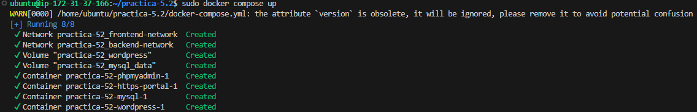
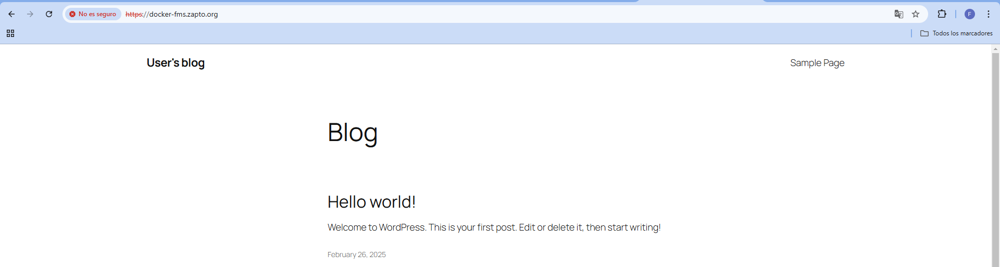

# practica-5.2
En esta práctica vamos a instalar WordPress, haciendo uso de Docker y Docker Compose.

Para ello, vamos a utilizar un archivo para instalar los docker (no es necesario, si ya tenemos los docker instalados), un archivo llamado `docker-compose.yml` y por último un archivo de varibales denominado `.env`

A continuación dejo el contenido de los archivos usado en esta práctica:

## instalar_docker.sh OPCIONAL:
```bash
#Script de instalación de Docker y Docker Compose
#Referencia: https://docs.docker.com/engine/install/ubuntu/
set -x

#Actualizamos los repositorios
apt update

#Instalamos los paquetes necesarios para que apt pueda usar repositorios sobre HTTPS
apt install -y \
    ca-certificates \
    curl \
    gnupg \
    lsb-release

#Añadimos la clave GPG oficial de Docker
mkdir -p /etc/apt/keyrings
curl -fsSL https://download.docker.com/linux/ubuntu/gpg | gpg --dearmor -o /etc/apt/keyrings/docker.gpg

#Añadimos el repositorio oficial de Docker a nuestro sistema
echo \
  "deb [arch=$(dpkg --print-architecture) signed-by=/etc/apt/keyrings/docker.gpg] https://download.docker.com/linux/ubuntu \
  $(lsb_release -cs) stable" | sudo tee /etc/apt/sources.list.d/docker.list > /dev/null

#Actualizamos la lista de paquetes
apt update

#Instalamos la última versión de Docker y Docker Compose
apt install -y docker-ce docker-ce-cli containerd.io docker-compose-plugin

#Añadimos el usuario actual al grupo docker
usermod -aG docker $USER

#Habilitamos el servicio de Docker para que se inicie automáticamente al arrancar el sistema
systemctl enable docker

#Iniciamos el servicio de Docker
systemctl start docker
```

## docker-compose.yml:
```yml
version: '3'

services:
  mysql:
    env_file:
      - .env
    image: mysql:8.0
    environment:
      - MYSQL_ROOT_PASSWORD=${MYSQL_ROOT_PASSWORD}
      - MYSQL_DATABASE=${WORDPRESS_DB_NAME}
      - MYSQL_USER=${WORDPRESS_DB_USER}
      - MYSQL_PASSWORD=${WORDPRESS_DB_PASSWORD}
    volumes:
      - mysql_data:/var/lib/mysql
    networks:
        - backend-network
    restart: always

  phpmyadmin:
    image: phpmyadmin
    ports:
      - 8080:80
    environment: 
      - PMA_ARBITRARY=1
    networks:
      - backend-network
    restart: always

  wordpress:
    env_file:
      - .env
    image: bitnami/wordpress:latest
    environment:
      - DB_SERVER=mysql
      - WORDPRESS_DATABASE_USER=${WORDPRESS_DB_USER}
      - WORDPRESS_DATABASE_NAME=${WORDPRESS_DB_NAME}
      - WORDPRESS_DATABASE_PASSWORD=${WORDPRESS_DB_PASSWORD}
      - WORDPRESS_DATABASE_HOST=mysql
      - WORDPRESS_DATABASE_PORT_NUMBER=3306
    volumes:
      - wordpress:/var/www/html
    networks:
      - backend-network
      - frontend-network
    restart: always
    depends_on:
      - mysql

  https-portal:
    image: steveltn/https-portal:1
    ports:
      - 80:80
      - 443:443
    restart: always
    environment:
      DOMAINS: "${DOMAIN} -> http://wordpress:8080"
      stage: 'production'
    networks:
      - frontend-network

volumes: 
  mysql_data:
  wordpress:

networks:
  backend-network:
  frontend-network:
```

## archivo de variables .env:
```
MYSQL_ROOT_PASSWORD=a
WORDPRESS_DB_NAME=wordpress
WORDPRESS_DB_USER=fran
WORDPRESS_DB_PASSWORD=a

WORDPRESS_DB_USER=fran
WORDPRESS_DB_NAME=a
WORDPRESS_DB_PASSWORD=a

DOMAIN=docker-fms.zapto.org
```

Ahora, dejo capturas para validar el uso de los scripts:
### Captura del resultado del `docker-compase.yml`:


### Captura del funcionamiento de la página:

